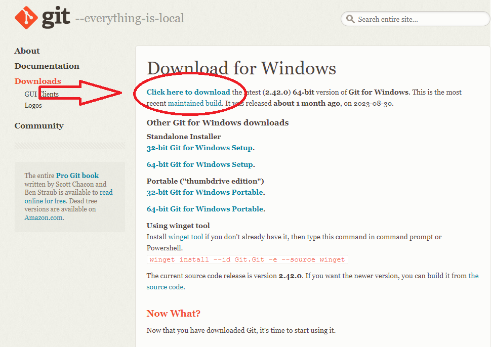
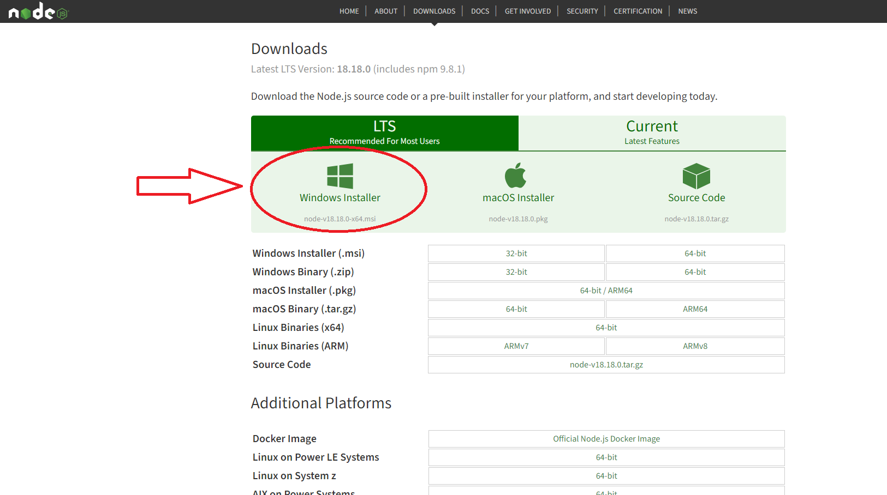

# Jak uruchomić wszystko?

## Co jest na pewno potrzebne:

- git (do pobrania z https://git-scm.com/download/win)
  

1. Wchodzimy do katalogu w którym chcemy mieć program przy użyciu `cmd` (Command Prompt)
2. `git clone git@github.com:cncPomper/azs-scoreboard-dev.git`
3. Wchodzimy do katalogu `azs-scoreboard-dev/`
4. Instalujemy brakujące biblioteki:
  a. w folderze `scoreboard/` wykonujemy komendę
  ```bash
  npm ci
  ```
  b. w folderze `side-panel/` wykonujemy komendę
  ```bash
  npm ci
  ```
  c. w folderze `azs-scoreboard-dev/` wykonujemy komendę
  ```bash
  npm ci
  ```
5. Program uruchamiamy tą komendą(w cmd)
```bash
npm run azs
```
(będąc w folderze `azs-scoreboard-dev/`)

Jeśli powyższa komenda nie zadziała prawdopodobnie należy doinstalować odpowiednie biblioteki:

- Node.js (do pobrania z https://nodejs.org/en/download)
  

Po pobraniu i instalacji node.js wykonujemy ponownie punkt 5.
W razie problemów proszę o kontakt na piotr.kitlowski@gmail.com
